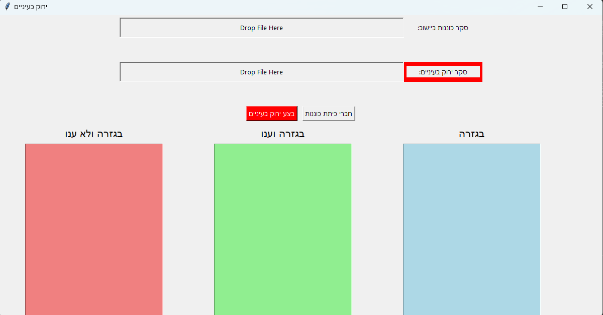

# אפליקציית GreenEyesApp

## סקירה כללית
האפליקציה  GreenEyesApp נוצרה כדי לייעל את תהליך הירוק בעיניים (תהליך בו מוודאים שכל הנמצאים תקינים ) וכך לקבל מידע מהיר מי תקין ומי צריך עזרה .
היא אפליקציית שולחן עבודה מבוססת Python שנבנתה באמצעות \`tkinter\` ו-\`tkinterdnd2\` לצורך עיבוד והצגת נתוני סקרים. 
האפליקציה מספקת ממשק משתמש גרפי (GUI) שבו משתמשים יכולים לגרור ולשחרר קבצי סקרים ולראות נתונים מסווגים בוווידג'טים של טקסט. האפליקציה מותאמת לטיפול בסקרים מסוג "כוננות בישוב" ו-"ירוק בעיניים", תוך עיבוד התגובות וסיווגן על פי קריטריונים מוגדרים מראש.  סקרים אלו מיוצאים מסקרי וואטסאפ באמצעות הרחבת הכרום Export WhatsApp Surveys.

## מה יש באפליקציה:
קובץ  names.csv מוסבר בהמשך. 
האפליקציה כוללת 2 שדות של קליטת קבצי הסקרים 
בנוסף קיים בה 2 כפתורים : **חברי כיתת כונננות** ,**בצע ירוק בעיניים**  
בחלק התחתון קיימים 3 שדות של טקסט כאשר הכותרת של משתנה בהתאם לכפתור הנלחץ :  
**חברי כיתת כוננות** \ **בגזרה** : שמות חברי כיתת הכוננות ומספר הטלפון שלהם נגרף מהקובץ "names.csv" \ שמות חברי כיתת הכוננות אשר בגזרה נגרף מהסקר "כוננות ביישוב"  
**בגזרה וענו לסקר** :  שמות חברי כיתת הכוננות שענו "תקין" בסקר "ירוק בעיניים" 
**בגזרה ולא ענו לסקר** : שמות חברי כיתת הכוננות שלא ענו "תקין" או ענו "צריך עזרה" בסקר "ירוק בעיניים"

המערכת לוקחת מהקובץ "names" את השמות ומספר הטלפון של חברי כיתת הכוננות ועל פי תוצאת הסקרים אשר מפורטים על ידי מספרי הטלפון שלהם מציגה את השמות בהתאם 

## תוכן הסקרים :
**ירוק בעיניים** : סקר אשר כולל את האופציות : 
1.תקין  
2. צריך העזרה

**כוננות ביישוב**: סקר אשר כולל את האופציות : 
1.ביישוב 
2.קרוב ליישוב 
3.מחוץ לאיזור

## תכונות
**גרירה ושחרור קבצים**: משתמשים יכולים לגרור ולשחרר קבצים ישירות לאפליקציה. 
**עיבוד קבצים**:
   טעינת נתוני חברים מתוך קובץ \`names.csv\`. 
  -עיבוד קבצי סקר מסוג "כוננות בישוב" ו-"ירוק בעיניים". 
  -סיווג טלפונים לאזורים וסטטוסי תגובה. 
**הצגת נתונים**: 
  -הצגת תגובות חסרות, תגובות נענות, וכל הנתונים בצבעים שונים בווידג'טים של טקסט. 
-**ניהול שגיאות**:
  -התרעה למשתמשים במקרה של קבצים חסרים או בפורמט שגוי.

## דרישות
- Python 3.x
- \`tkinter\` (מובנה בפייתון)
- \`tkinterdnd2\`

## מבנה הקבצים  
הקובץ 
-\`names.csv\`: קובץ CSV שמכיל נתוני חברים עם שמות ומספרי טלפון.
 
הקובץ - 
\`verify_green.py\`: הסקריפט הראשי להרצת האפליקציה.
 
הקובץ
-\`tkdnd2.8/\`: קבצים נדרשים להפעלת \`tkinterdnd2\`.

## פורמט קבצים נדרשים
### \`names.csv\`
קובץ CSV במבנה הבא:
 Name,Phone
<pre>
John Doe,1234567890
Jane Smith,0987654321
</pre>

## ניהול שגיאות
 
-אם קובץ נדרש לא נטען, תוצג התראה למשתמש.
 
-אם פורמט הקובץ אינו תקין, תוצג תיבת דיאלוג עם שגיאה.

## התאמות אישיות
 
-עדכנו את קובץ \`names.csv\` להוספה או עדכון של חברים.
 
-עדכנו את צבעי הממשק על ידי שינוי פרמטר \`bg_color\` במתודה \`create_text_widget\`.

## בעיות ידועות
-ודאו שקידוד הקובץ הוא UTF-8 לצורך תאימות.

## תמונה

